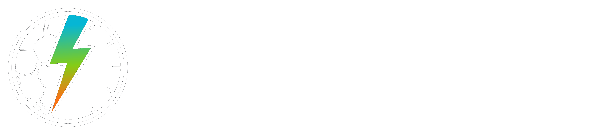

  <picture>
    <source media="(prefers-color-scheme: dark)" srcset="../.github/logo-bora-rachao-white.png">
    <source media="(prefers-color-scheme: light)" srcset="../.github/logo-bora-rachao-black.png">
    
  </picture>
  
  # Plataforma para organização de partidas esportivas
  ### Centro Paula Souza
  ### Faculdade de Tecnologia de Jahu 
  ### Curso de Tecnologia em Desenvolvimento de Software Multiplataforma
  ### Jaú, SP, BR
  ### Início: 1º Semestre / 2025
  # Organização do GitHub

